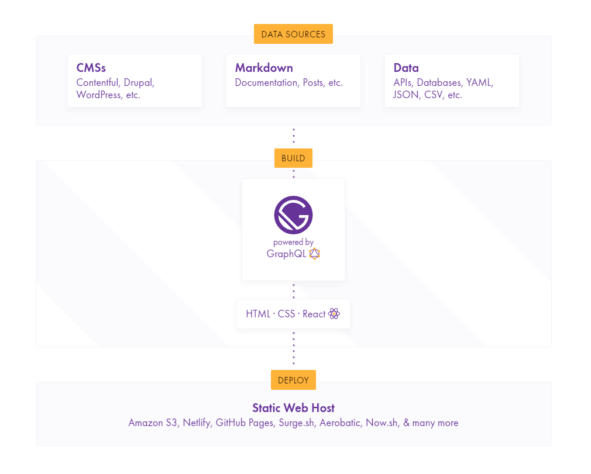

I finally jumped on the [GatsbyJS](https://gatsbyjs.org) hype train! With good reason, of course. 

A few months ago, when I wasn't nearly as well-versed in JavaScript, I attempted building a Gatsby blog. I struggled to understand how GraphQL worked without a server or api, and I didn't know much React. Revisiting Gatsby with better JavaScript knowledge has made all the difference. 

### Why GatsbyJS?
Gatsby is a static site generator built on React and [GraphQL](https://graphql.org). It is much different from WordPress: it's built on React, it creates a Progressive Web App (PWA), and it's serverless (*huge!*).

*What does this mean?*

This means I can deploy my website like any other static site (shouldn't have to pay for hosting!) and develop dead simple workflows with the many flexible Gatsby plugins to update my site. I use [Netlify](https://netlify.com), which feels like its practically made for Gatsby. I simply create posts in Markdown files and push my changes to git. Netlify will detect my changes and run `gatsby build`, compiling my markdown files into a static build folder, updating the site in a matter of seconds!

To take Gatsby another step forward - you can use [WordPress](https://github.com/gatsbyjs/gatsby/tree/master/packages/gatsby-source-wordpress) with GatsbyJS! In fact, with the power of GraphQL you can use nearly any headless CMS with Gatsby. Some notable examples include [Contentful](https://contentful.com) and [Netlify CMS](https://www.netlifycms.org/).

Here's an image taken from the Gatsby website that might help visualize what I'm saying.

Gatsby is worked on by an excellent team, providing all kinds of plugins that create a really high quality website. Tasks that would otherwise be much more complicated like lazy-loading and routing can be done in record-time with Gatsby!

### Moving from WordPress
I am primarily a WordPress developer, working in PHP. However, with WordPress 5.0 and Gutenberg coming out, it is imperative to start learning JavaScript and React. [Custom blocks](https://github.com/ahmadawais/create-guten-block) are the future!

Working with Gatsby has made my transition from WordPress to JavaScript a breeze. GraphQL is amazing, and I'm going to be using it in future projects for sure. In fact, it's so fun to use that I might develop a GraphQL wrapper for the Riot API on the side.

Thanks for reading!